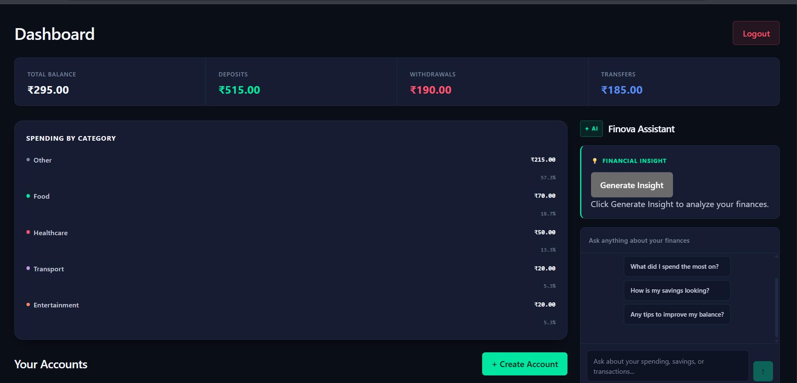
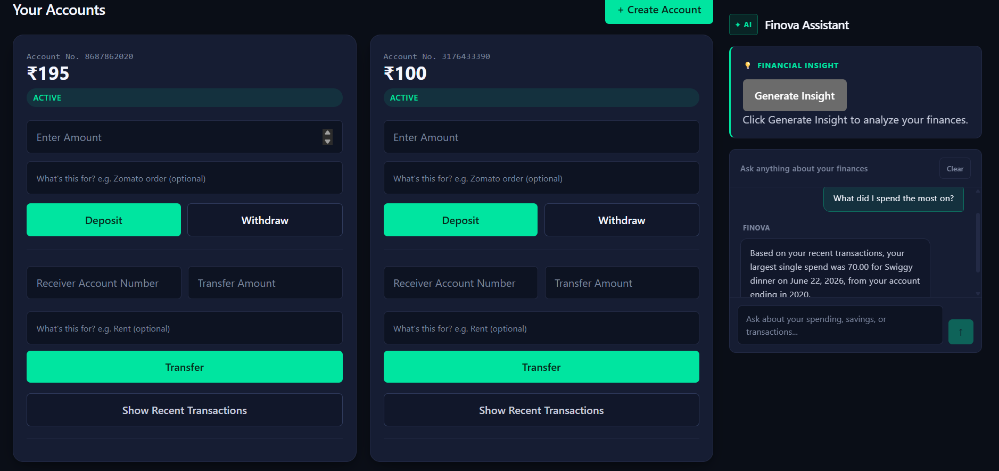
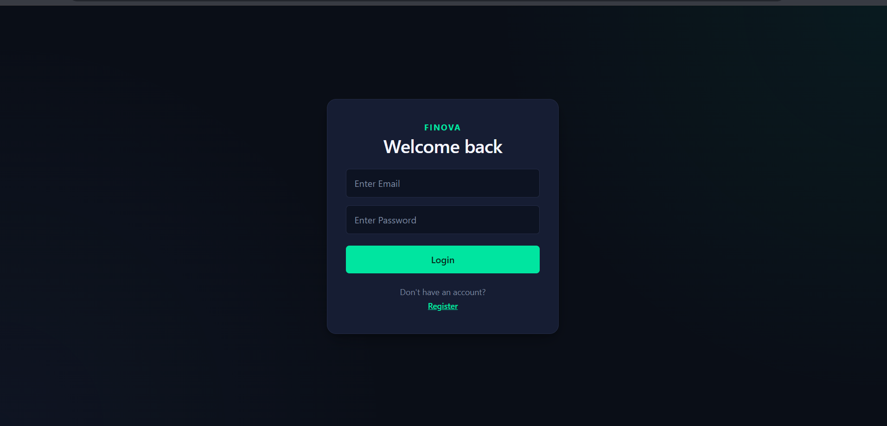
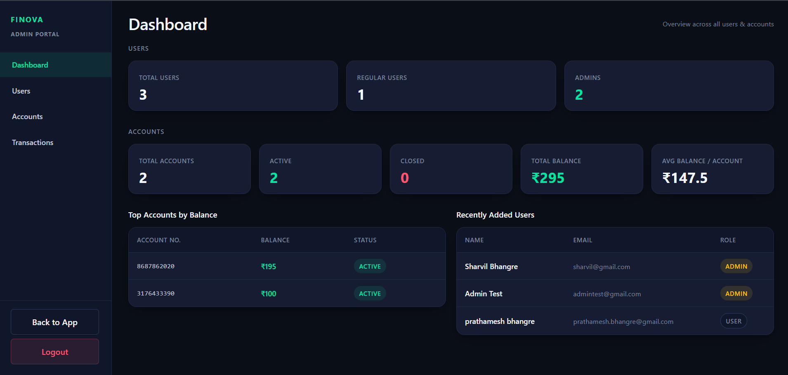

# 🏦 Finova — AI-Powered Banking Application

      

A full-stack banking platform with JWT-secured REST APIs, multi-account transaction management, and Google Gemini AI integration for real-time spending categorization and a conversational financial assistant. Containerized with Docker and deployed via an automated GitHub Actions CI/CD pipeline.

**[Live Demo](https://finova-weld.vercel.app)** • [Features](#features) • [Tech Stack](#tech-stack) • [Architecture](#architecture) • [Getting Started](#getting-started) • [Deployment](#deployment)

> **Note:** The backend is hosted on Render's free tier, which spins down after periods of inactivity. The first request after idle time may take 30–50 seconds to wake up.

---

## Live Links

| Service | URL |
|---|---|
| **Frontend** | [finova-weld.vercel.app](https://finova-weld.vercel.app) |
| **Backend API** | [finova-backend-latest.onrender.com](https://finova-backend-latest.onrender.com) |

---

## Features

### 👤 User Portal
- Multi-account management (create, view, activate/close accounts)
- Deposits, withdrawals, and peer-to-peer transfers with balance validation
- Full transaction history with date-range filtering
- **AI-powered spending breakdown** — transactions auto-categorized at write time (Food, Transport, Shopping, etc.), no separate API call needed to view the breakdown
- **On-demand AI financial insights** — a "Generate Insights" button triggers a one-time Gemini call to summarize spending habits and balance trends, decoupled from the category breakdown so Gemini is never called just to load the dashboard
- **Conversational AI financial assistant** — multi-turn chat with context injection (balances, recent transactions, masked account numbers)

### 🛡️ Admin Portal
- View and manage all users and accounts
- Activate or close any account
- Full transaction visibility across all users
- Role-based routing — `/admin/*` routes are inaccessible to regular users both on the frontend (route guard) and backend (`hasRole("ADMIN")`)

### 🔐 Security
- Stateless JWT authentication with custom `JwtAuthFilter`, including expiry validation
- BCrypt password hashing
- Role-based access control (`USER` / `ADMIN`) enforced at the route level via Spring Security
- Login response includes role, so the frontend routes directly to `/admin` or `/dashboard` with no extra round-trip

### 🐳 Deployment & CI/CD
- Multi-stage Dockerfile (build stage with JDK, runtime stage with JRE only — smaller final image)
- GitHub Actions pipeline: every push to `master` builds the jar, builds the Docker image, and publishes it to Docker Hub
- Backend deployed on **Render** directly from the Docker Hub image
- Frontend deployed on **Vercel**, pointed at the live Render API via environment variable

---

## Tech Stack

| Layer | Technology |
|---|---|
| **Backend** | Java 21, Spring Boot 4, Spring Security, JPA/Hibernate |
| **Frontend** | React, Vite, Axios |
| **Database** | PostgreSQL |
| **AI** | Google Gemini API (via Spring `RestClient`) |
| **Auth** | JWT, BCrypt |
| **Containerization** | Docker (multi-stage build) |
| **CI/CD** | GitHub Actions → Docker Hub |
| **Hosting** | Render (backend + PostgreSQL), Vercel (frontend) |
| **Build** | Maven |

---

## Architecture

```
finova/
├── Dockerfile                # multi-stage build (JDK builder → JRE runtime)
├── docker-compose.yml        # local dev: Spring Boot + PostgreSQL together
├── .github/workflows/
│   └── deploy.yml            # CI/CD: build → Docker image → push to Docker Hub
├── src/
│   └── main/java/org/project/bank2/
│       ├── config/            # Security config, CORS, beans
│       ├── controller/        # REST controllers (Auth, Account, Transaction, AI)
│       ├── service/           # Business logic + Gemini integration
│       ├── model/             # JPA entities
│       ├── dto/                # Request/Response DTOs
│       ├── repo/               # Spring Data JPA repositories
│       ├── security/          # JwtAuthFilter, JwtService
│       └── exception/         # GlobalExceptionHandler
└── frontend/
    └── src/
        ├── pages/             # Dashboard, Login, Register, Admin
        ├── routes/            # AdminRoute (role-based guard)
        └── components/        # AiAssistant, SpendingSummary, TransactionList
```

### AI Integration Flow

Two independent Gemini touchpoints — categorization is automatic, insights are opt-in:

```
New Transaction (withdrawal/transfer)
      │
      ▼
TransactionService.save()
      │
      ▼
GeminiService.categorize(description, note)
      │   Gemini API call with Indian context examples
      ▼
category persisted to DB (e.g. "Food", "Transport")
      │
      ▼
SpendingSummary reads category directly from the transaction DTO
(no Gemini call on dashboard load)


User clicks "Generate Insights"
      │
      ▼
GeminiService.generateInsight(accountSummary)
      │   one-time Gemini call, only on explicit user action
      ▼
AiAssistant displays the generated insight
```

---

## Getting Started

### Prerequisites
- Java 21+
- Node.js 18+
- Docker (optional, for containerized local dev)
- PostgreSQL (if not using Docker)
- Google Gemini API key

### Option A — Run with Docker (recommended)

```bash
# Clone the repo
git clone https://github.com/sharvil-stack/Finova.git
cd Finova

# Set your Gemini API key as an environment variable
# (docker-compose.yml reads DB_URL / DB_USERNAME / DB_PASSWORD automatically
#  for a local PostgreSQL container — only GEMINI_API_KEY needs to be supplied)
export GEMINI_API_KEY=your_gemini_api_key

docker-compose up
```

This spins up Spring Boot + PostgreSQL together. Backend will be available on `http://localhost:8080`.

### Option B — Run manually

```bash
# Clone the repo
git clone https://github.com/sharvil-stack/Finova.git
cd Finova

# Configure environment
# Edit src/main/resources/application.properties or set as env vars:
# DB_URL=jdbc:postgresql://localhost:5432/finova
# DB_USERNAME=your_username
# DB_PASSWORD=your_password
# GEMINI_API_KEY=your_gemini_api_key

# Run
./mvnw spring-boot:run
```

### Frontend Setup

```bash
cd frontend
npm install

# .env
# VITE_API_URL=http://localhost:8080   (or the live Render URL)

npm run dev
```

Frontend runs on `http://localhost:5173`, backend on `http://localhost:8080`.

### Default Admin Setup

Since JWT contains no role claim by default, assign the admin role manually after registering:

```sql
UPDATE users SET role = 'ADMIN' WHERE email = 'your@email.com';
```

Logging in afterward will route directly to `/admin` instead of `/dashboard`.

---

## Deployment

The project ships with a full CI/CD pipeline:

```
git push origin master
      │
      ▼
GitHub Actions (.github/workflows/deploy.yml)
      │  1. Checkout code
      │  2. Build jar with Maven
      │  3. Build multi-stage Docker image
      │  4. Push image to Docker Hub
      ▼
sharvil26/finova-backend:latest
      │
      ▼
Render pulls the image and redeploys automatically
```

The frontend deploys separately via Vercel's own GitHub integration, building from the `frontend/` directory on every push to `master`.

To deploy your own fork:
1. Set up a Docker Hub account and add `DOCKERHUB_USERNAME` / `DOCKERHUB_TOKEN` as GitHub repo secrets
2. Push to `master` — the image builds and publishes automatically
3. Create a Render Web Service pointed at your Docker Hub image, with `DB_URL`, `DB_USERNAME`, `DB_PASSWORD`, and `GEMINI_API_KEY` set as environment variables
4. Deploy the `frontend/` directory to Vercel with `VITE_API_URL` set to your Render backend URL

---

## Key API Endpoints

| Endpoint | Description |
|---|---|
| `POST /auth/register` | Register new user |
| `POST /auth/login` | Get JWT token + role |
| `GET /account/my-accounts` | Fetch user's accounts |
| `POST /transaction/deposit` | Deposit funds |
| `POST /transaction/withdraw` | Withdraw funds |
| `POST /transaction/transfer` | Peer-to-peer transfer |
| `GET /transaction/{accountNumber}` | Full transaction history (used for spending breakdown) |
| `POST /ai/ask` | Conversational AI assistant |
| `POST /ai/insights` | On-demand AI spending insight (Gemini, called only on user action) |
| `GET /users` | All users (`ADMIN` only) |

---

## Screenshots

### Dashboard — Spending Breakdown
AI-categorized transactions rendered as a live spending chart, computed entirely from data already stored in the DB — no Gemini call on page load.



### AI Financial Assistant
Multi-turn conversational assistant with context injection (balances, recent transactions, masked account numbers).



### Login


### Admin Portal
Role-based access control in action — only reachable with an `ADMIN` role, enforced on both frontend and backend.



---

## License

MIT License — feel free to use this as a reference for your own projects.

---

Built by [Sharvil Bhangre](https://github.com/sharvil-stack)
